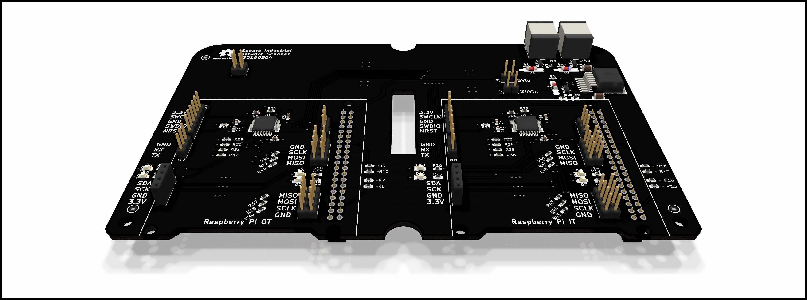
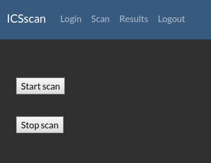
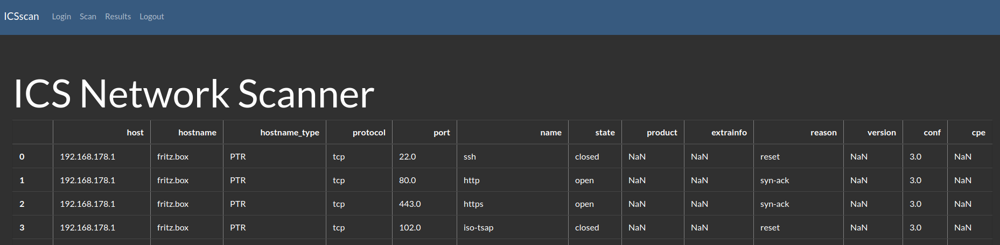

# A Secure Network Scanner Architecture for Asset Management in Strongly Segmented ICS Networks

<table align="center"><tr><td align="center" width="9999">
</img>
</td></tr></table>

This GIT provides all necessary material to setup the network scanner for industrial networks.
The network scanner is based on a strict segmentation between the OT and IT network.
For this two Raspberry Pis, one in the IT network and the other in the OT network are used.
These are communicating over a SPI bus with each other, where a microcontroller is placed in acting
as a data filter/diode.

## Prototype
All this is implemented on a central PCB, where all parts get attached to.
The image below shows the PCB of the network scanner.

<table align="center"><tr><td align="center" width="9999">
</img>
</td></tr></table>

A fully assebled network scanner, with the two Raspberry Pis and OLED displays is illustraed below.

<table align="center"><tr><td align="center" width="9999">
</img>
</td></tr></table>

## Scan control and results (Web frontend)

The scan can be started and stopped over the web frontend.
<table align="center"><tr><td align="center" width="9999">
</img>
</td></tr></table>

The results are shown in a table.
<table align="center"><tr><td align="center" width="9999">
</img>
</td></tr></table>

## Content
* [Software](software/README.md)
* [Hardware](hardware/README.md)
* [Images](images/README.md)

