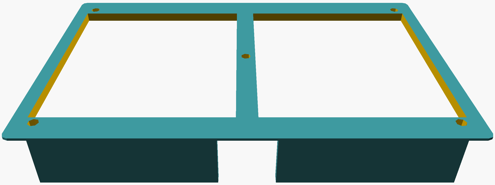

# Case/Mounting Plate for Network Scanner

Modelling with OpenSCAD
'''zsh
sudo add-apt-repository ppa:openscad/releases
sudo apt-get install openscad
'''

Printing with CURA

## 3D Printing

Start the printing and grab a coffee.

<table align="center"><tr><td align="center" width="9999">
</img>
</td></tr></table>

<table align="center"><tr><td align="center" width="9999">
</img>
</td></tr></table>
